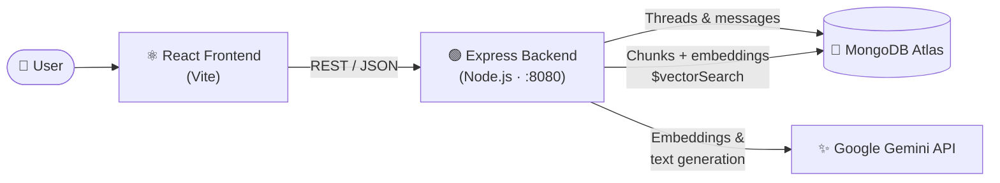
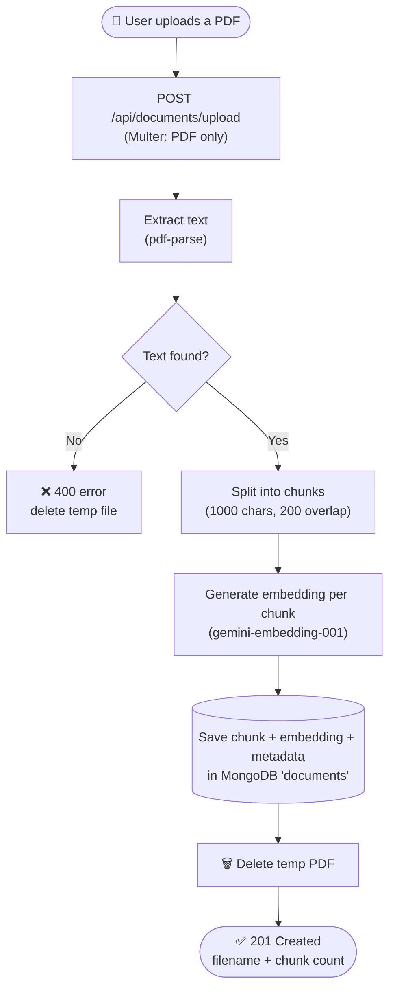
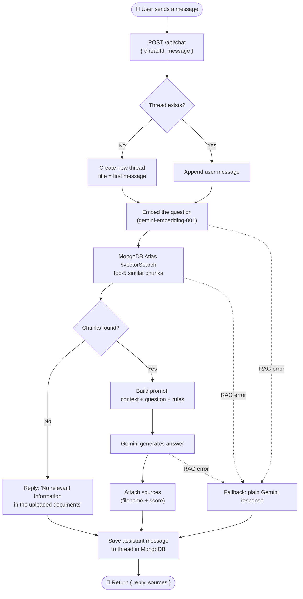
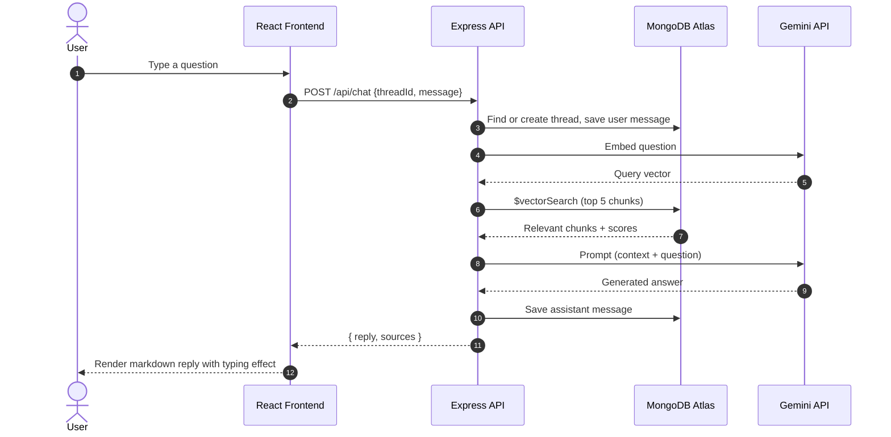

#  SigmaGPT

**An AI-powered conversational assistant with Retrieval-Augmented Generation (RAG).**
Chat with Google Gemini, or upload your own PDFs and ask questions grounded in their content.


---

## Table of Contents

- [Features](#-features)
- [Tech Stack](#-tech-stack)
- [Workflow Diagrams](#-workflow-diagrams)
- [Project Structure](#-project-structure)
- [Getting Started](#-getting-started)
- [Environment Variables](#-environment-variables)
- [MongoDB Vector Index Setup](#-mongodb-vector-index-setup)
- [API Reference](#-api-reference)
- [How RAG Works Here](#-how-rag-works-here)
- [Roadmap](#-roadmap)
- [Author](#-author)

---

## ✨ Features

- **Conversational chat** powered by Google Gemini
-  **PDF upload & question answering** using a RAG pipeline
-  **Semantic search** with Gemini embeddings and MongoDB Atlas Vector Search
-  **Multi-thread chat history**: create, switch between, and delete conversations
-  **Graceful fallback**: if the RAG pipeline fails, the app falls back to a normal Gemini response
-  **Source attribution**: replies include the document sources and similarity scores used
-  **Markdown + syntax-highlighted code** rendering in replies
-  **Typing animation** for assistant responses

---

## 🛠 Tech Stack

| Layer | Technology |
|-------|-----------|
| **Frontend** | React 19, Vite, React Context API, `react-markdown`, `rehype-highlight`, `react-spinners` |
| **Backend** | Node.js, Express 5, Multer (file uploads), `pdf-parse` |
| **Database** | MongoDB Atlas, Mongoose, Atlas Vector Search |
| **AI / LLM** | Google Gemini via `@google/genai` (chat model + `gemini-embedding-001`) |

---

## Workflow Diagrams

### 1. High-Level Architecture



### 2. Document Ingestion Workflow (PDF Upload)



### 3. Chat / RAG Query Workflow



### 4. Request Sequence



---

## 📁 Project Structure

```
sigmaGPT/
├── BACKEND/
│   ├── models/
│   │   ├── Documents.js       # Chunk + embedding schema
│   │   └── Threads.js         # Thread & message schema
│   ├── routes/
│   │   ├── chat.js            # Thread CRUD + chat endpoint (RAG)
│   │   └── documents.js       # PDF upload & ingestion endpoint
│   ├── services/
│   │   ├── pdfParser.js       # Extract text from PDF
│   │   ├── chunker.js         # Split text into overlapping chunks
│   │   ├── embeddings.js      # Generate Gemini embeddings
│   │   ├── retriever.js       # MongoDB vector search
│   │   └── rag.js             # Build RAG prompt & generate answer
│   ├── utils/
│   │   └── openai.js          # Gemini text-generation helper
│   ├── uploads/               # Temporary PDF storage
│   └── server.js              # Express app entry point
│
├── Frontend/
│   └── src/
│       ├── App.jsx            # Root component + context provider
│       ├── MyContext.jsx      # Global state (React Context)
│       ├── Sidebar.jsx        # Thread history, new chat, delete
│       ├── ChatWindow.jsx     # Input, send, PDF upload
│       ├── Chat.jsx           # Message list + markdown rendering
│       └── *.css              # Styles
│
└── README.md
```

---

## Getting Started

### Prerequisites

- [Node.js](https://nodejs.org/) v18 or later
- A [MongoDB Atlas](https://www.mongodb.com/atlas) cluster (Vector Search is required for RAG)
- A [Google Gemini API key](https://aistudio.google.com/app/apikey)

### 1. Clone the repository

```bash
git clone https://github.com/<your-username>/sigmaGPT.git
cd sigmaGPT
```

### 2. Set up the backend

```bash
cd BACKEND
npm install
```

Create a `.env` file in `BACKEND/` (see [Environment Variables](#-environment-variables)), then start the server:

```bash
npm run dev      # development (nodemon)
# or
npm start        # production
```

The API runs on **http://localhost:8080**.

### 3. Set up the frontend

Open a new terminal:

```bash
cd Frontend
npm install
npm run dev
```

The app runs on **http://localhost:5173** (Vite's default).

---

## 🔐 Environment Variables

Create `BACKEND/.env`:

```env
GEMINI_API_KEY=your_gemini_api_key_here
MONGODB_URI=your_mongodb_atlas_connection_string_here
```

| Variable | Description |
|----------|-------------|
| `GEMINI_API_KEY` | API key from Google AI Studio |
| `MONGODB_URI` | MongoDB Atlas connection string |

> ⚠️ **Never commit your `.env` file.** Make sure it is listed in `.gitignore`.

---

## 🧠 MongoDB Vector Index Setup

RAG retrieval needs an Atlas Vector Search index on the `documents` collection. In Atlas, go to **Database → your cluster → Search & Vector Search → Create Index → Vector Search (JSON editor)**, and use:

```json
{
  "fields": [
    {
      "type": "vector",
      "path": "embedding",
      "numDimensions": 3072,
      "similarity": "cosine"
    }
  ]
}
```

- **Index name:** `vector_index` (must match the name used in `services/retriever.js`)
- **Dimensions:** `3072` is the default output size of `gemini-embedding-001`. If you change the embedding configuration, update this value to match.

---

## 📡 API Reference

Base URL: `http://localhost:8080/api`

### Chat & Threads

| Method | Endpoint | Description |
|--------|----------|-------------|
| `GET` | `/thread` | List all threads (newest first) |
| `GET` | `/thread/:threadId` | Get all messages in a thread |
| `DELETE` | `/thread/:threadId` | Delete a thread |
| `POST` | `/chat` | Send a message and get a reply |

**`POST /chat`**

```json
// Request
{ "threadId": "uuid-string", "message": "Summarize the uploaded report" }

// Response
{
  "reply": "The report states that...",
  "sources": [
    { "filename": "report.pdf", "score": 0.87 }
  ]
}
```

### Documents

| Method | Endpoint | Description |
|--------|----------|-------------|
| `POST` | `/documents/upload` | Upload a PDF (`multipart/form-data`, field name `file`) |

**`POST /documents/upload`**

```json
// Response (201)
{
  "message": "PDF uploaded and processed successfully",
  "filename": "report.pdf",
  "chunks": 42,
  "documentIds": ["..."]
}
```

---

## 📖 How RAG Works Here

1. **Ingest:** an uploaded PDF is parsed to text and split into ~1000-character chunks with a 200-character overlap, so context isn't lost at chunk boundaries.
2. **Embed:** each chunk is converted into a vector with `gemini-embedding-001` and stored in MongoDB next to its text and metadata.
3. **Retrieve:** when you ask a question, it is embedded the same way, and MongoDB Atlas `$vectorSearch` returns the 5 most semantically similar chunks.
4. **Generate:** the retrieved chunks are injected into a prompt that instructs Gemini to answer *only* from the provided context, and to say so when the answer isn't in the documents.
5. **Respond:** the answer and its sources are returned to the UI and saved to the thread history.

---

## 🗺 Roadmap

- [ ] Pass previous messages to the model for true multi-turn memory
- [ ] Link uploaded documents to specific users or threads
- [ ] Streaming responses (SSE) instead of the simulated typing effect
- [ ] Authentication and user accounts
- [ ] Support for more file types (DOCX, TXT, Markdown)
- [ ] Move the hard-coded API URL (`localhost:8080`) into an environment variable
- [ ] Docker setup for one-command deployment

---

## 👨‍💻 Author

**Sidheswar**

Built with ♥ as an AI-powered conversational assistant project.

If you find this project useful, consider giving it a ⭐ on GitHub!
